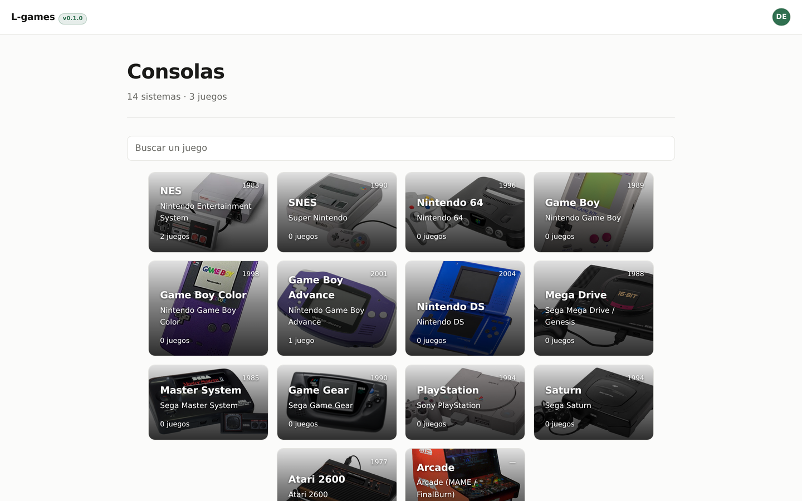
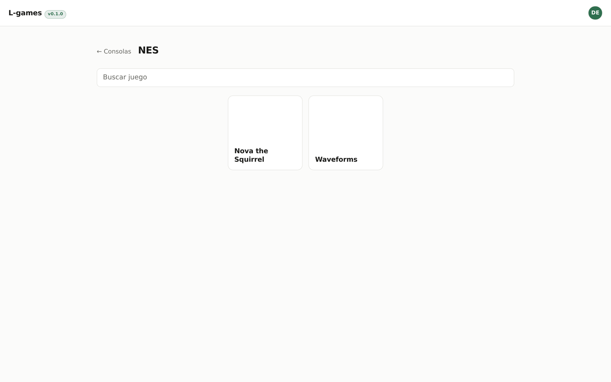
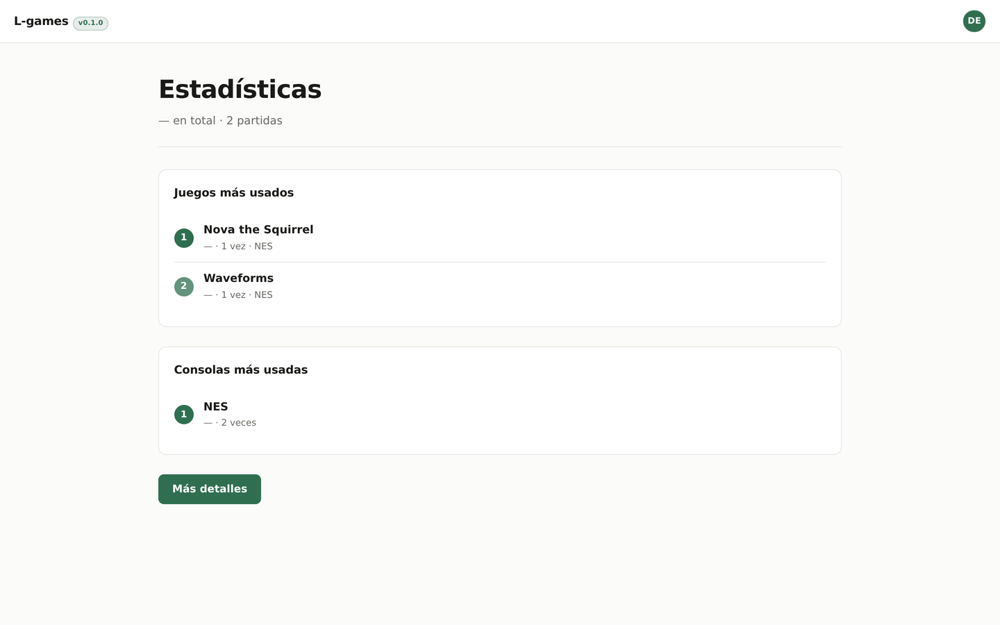
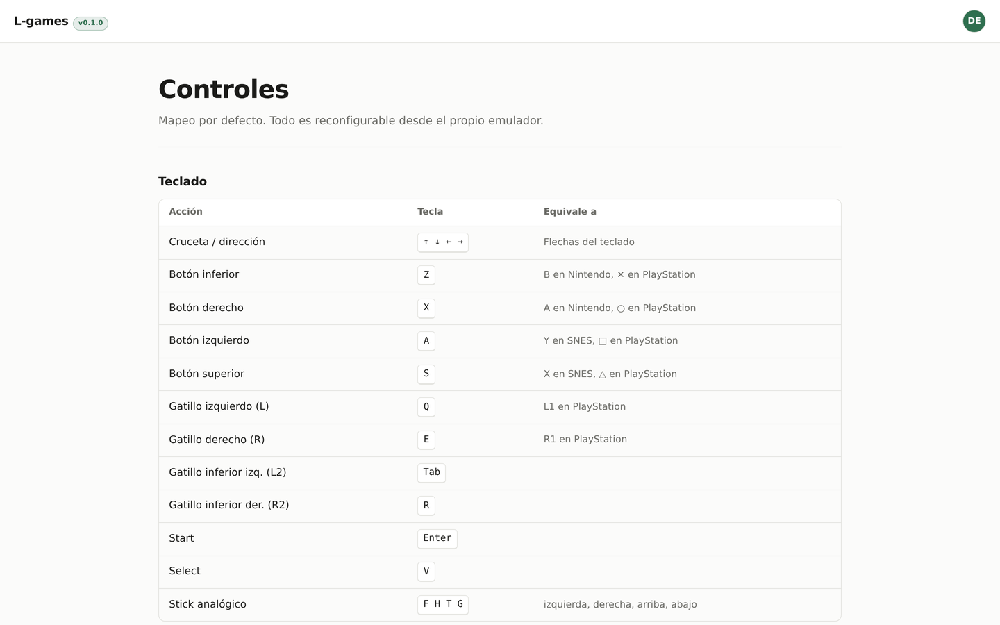
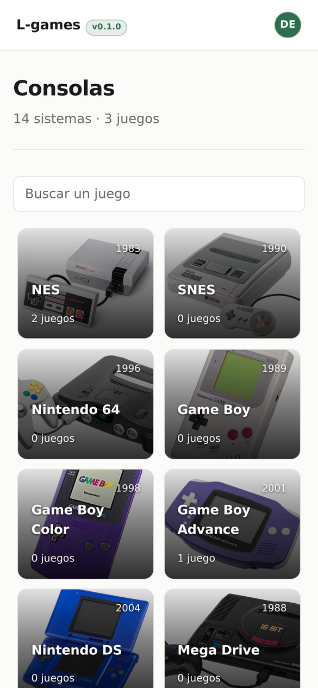

# L-games

Emuladores de consola en el navegador, con acceso restringido. Envuelve
[EmulatorJS](https://emulatorjs.org) (cores de libretro compilados a
WebAssembly) en una app Express con login.

En producción: `l-games.lepayimio.es`. La configuración del servidor vive en el
repositorio **lepayimio-infra**.

## Capturas

<p align="center"></p>

<table>
<tr>
<td width="50%"><br><sub>Los juegos de cada consola.</sub></td>
<td width="50%"><br><sub>Partidas y tiempo por juego.</sub></td>
</tr>
<tr>
<td><br><sub>Mapeo por defecto, reconfigurable desde el propio emulador.</sub></td>
<td><br><sub>La estantería en el móvil.</sub></td>
</tr>
</table>

## ROMs y partidas

Las ROMs se alojan en el servidor, en `roms/<sistema>/`, y se suben desde la
propia web. La subida va por `PUT` en streaming directo a disco: el fichero no
pasa por memoria, así que una imagen de CD de 700 MB no infla el proceso. Se
escribe a un temporal y se renombra al terminar, de modo que una subida cortada
nunca deja un fichero a medias.

**Las ROMs son compartidas entre usuarios; las partidas no.** Cada usuario tiene
las suyas en `saves/<usuario>/<sistema>/`:

```
<juego>.srm                     memoria de partida del propio juego
<juego>.srm.bak                 version anterior, por si algo la pisa
estados/<juego>.<n>.state       estado guardado de la ranura n (1-9)
estados/<juego>.<n>.png         captura de esa ranura
```

Son dos cosas distintas y ambas viven en el servidor: **el guardado del propio
juego** —la SRAM, lo que graba Pokémon al pasar por un centro— y **los estados**,
que son una foto exacta de la consola en un instante.

### Cómo se guardan las partidas

La SRAM se sincroniza con el servidor cada 30 segundos, al ocultarse la pestaña y
al cerrarla. Se calcula una huella barata del contenido para no subir nada si la
partida no ha cambiado. Al cerrar la pestaña se usa `navigator.sendBeacon`, que
sobrevive a la página; como solo sabe hacer `POST`, la ruta de guardado acepta
`PUT` y `POST` con el mismo handler.

**El momento de restaurar es lo único que importa aquí.** El core lee la memoria
de partida al cargar la ROM y no vuelve a mirarla, así que inyectarla con el juego
ya arrancado llega tarde: el juego dice que no hay partida. La página descarga la
SRAM del servidor **antes** de cargar `loader.js` y la escribe en el disco virtual
en cuanto está montado, aprovechando el evento `saveDatabaseLoaded`, que
EmulatorJS emite después de montar `/data/saves` y antes de descargar la ROM.

Con el juego en marcha se repasa el resultado, que es cuando el emulador ya sabe
decir la ruta real de la memoria:

- Si el servidor tiene partida y no coincide con la del emulador, se inyecta y se
  **reinicia el core**: es la única forma de que la lea de verdad.
- Si el servidor no tiene nada y el navegador sí, gana el navegador y se sube.
  EmulatorJS guarda una copia local en IndexedDB, así que por aquí se recupera una
  partida que el servidor hubiera perdido.

### Nunca subir una partida en blanco

Una memoria de partida sin estrenar es un bloque uniforme: `0xFF` en la flash de
GBA, `0x00` en casi todo lo demás. Es justo lo que devuelve el emulador cuando
arranca sin haber restaurado nada, y **subirlo borra la partida buena**. Pasó: dos
`.srm` de Pokémon Esmeralda acabaron enteros a `0xFF`, porque bastaba abrir el
juego y esperar treinta segundos sin llegar a guardar.

Hay tres frenos, y el que de verdad protege es el último:

1. El cliente no sube nada hasta que la restauración se ha resuelto.
2. El cliente no sube nunca un bloque uniforme.
3. El servidor rechaza con `409` sobrescribir una partida con contenido por una
   vacía, y guarda la versión anterior en `.srm.bak` antes de cada cambio.

### Estados guardados

Nueve ranuras por juego y usuario, cada una con su captura, en el panel
**Estados** de la página de juego. Los botones de guardar y cargar estado de la
barra de EmulatorJS se interceptan con `EJS_onSaveState` y `EJS_onLoadState`:
cuando esos eventos tienen listener, la librería cancela su descarga a disco y su
selector de fichero, y el estado viaja al servidor, a la ranura activa.

Al abrir un juego se carga sola la ranura más reciente, pero **solo si es
posterior al guardado del propio juego**. Si no, quien guarde dentro del juego y
no en un estado vería su avance sustituido por una foto vieja al volver a entrar.

La captura viaja en una petición aparte del estado: son dos binarios y mezclarlos
en un `multipart` no aporta nada. Si falla, la ranura se queda sin imagen pero el
estado ya está a salvo.

También se puede **exportar** el `.srm` a disco e **importar** uno externo, que
se sube al servidor y se inyecta en la partida en curso sin recargar.

El botón nativo de guardado de EmulatorJS queda interceptado mediante
`EJS_onSaveSave`: cuando ese evento tiene algún listener, la librería cancela su
descarga a disco, y aprovechamos para guardar en el servidor.

### Seguridad de las rutas

Ni las ROMs ni las partidas se localizan concatenando lo que manda el cliente.
Se lista el directorio y se busca una coincidencia **exacta**; si no aparece,
404. Aunque el saneador de nombres fallara, no hay forma de salir del directorio.

Un detalle que costó un bug: `express.urlencoded` **no** puede montarse global.
Los clientes que suben un fichero sin `Content-Type` caen por defecto en
`application/x-www-form-urlencoded`, y el parser rechazaría la ROM por tamaño
antes de llegar al handler. Va montado solo en la ruta de login.

## Interfaz

Tres niveles: **consolas → juegos → jugar**. El índice muestra cuántos juegos
tiene cada sistema; dentro de cada consola se listan sus ROMs con el tamaño y
se sube contenido nuevo desde la propia web.

Hay una **guía de controles** en `/controles`, enlazada desde la barra superior.
El mapeo de teclado no está escrito a mano: sale de `defaultControllers` en
`data/src/emulator.js`. EmulatorJS usa el estándar RetroPad, así que cada
consola nombra sus botones de forma distinta pero por debajo son los mismos
cuatro; la guía incluye la tabla de equivalencias.

### En móvil y tablet

- **La pantalla de juego es fija**: no se desplaza en ningún eje, no rebota en
  los bordes y no hace zoom por doble toque. El resto del sitio conserva su
  scroll, porque la lista de consolas y la guía no caben en una pantalla.
- **En vertical el mando virtual va debajo del juego**, no encima: el lienzo
  ocupa el 44% superior y el mando el 56% restante. En apaisado se oculta la
  barra superior y los controles caen sobre las bandas negras laterales.
- Botón **Ajustes** en la esquina superior derecha, solo en dispositivos
  táctiles. Abre el menú del emulador con guardar y cargar estado, exportar e
  importar partida, trucos, ajustes de control, volumen y pantalla completa.

**El menú del emulador solo se abre con el botón.** EmulatorJS ignora los
`click` de tipo touch, pero su listener de `mousemove` no: un toque genera un
mousemove sintético y, si cae cerca del borde inferior —donde está el mando
virtual—, abría la barra sola mientras se jugaba. En lugar de pelearse con sus
listeners internos, se vigila con un `MutationObserver` la clase que controla
la visibilidad y se vuelve a ocultar si nadie pulsó Ajustes; así da igual por
qué camino intente abrirse. Solo se aplica en táctil: con ratón el
comportamiento por hover es el esperado.

  Llama a `EJS_emulator.menu.open(true)`: sin ese `true` la barra se
  autooculta a los tres segundos, que es lo que la hacía inservible con el
  dedo. Se muestra con `(hover: none) and (pointer: coarse)`, que distingue un
  dedo de un ratón mejor que el ancho de pantalla.

## Menú de usuario y estadísticas

La foto de perfil de la cabecera despliega un menú hacia la izquierda con
**editar perfil**, **estadísticas**, **controles** y **desconectarse**.

En `/estadisticas` hay un podio con los tres juegos y las tres consolas más
usados, y un botón que abre el detalle completo por consola y por juego con
tiempo, veces abierto y última partida.

El uso se contabiliza en `config/estadisticas.json`, por usuario y juego. El
cliente suma en tramos de 20 s y envía cada minuto, **sin contar los tramos en
que el emulador está pausado o aún no ha arrancado**; al cerrar la pestaña
manda lo pendiente con `sendBeacon`, que sobrevive a la descarga de la página
cuando un `fetch` normal se cancelaría.

El servidor **recorta cualquier envío a 300 segundos**: el cliente es
manipulable y no debe poder inflar el contador. Las escrituras se encadenan en
una sola promesa, porque dos latidos simultáneos harían leer-modificar-escribir
en paralelo y uno perdería lo del otro.

## Tarjetas de juego

Son cuadradas, como una carátula. Al pulsarlas se abre una ventana que **crece
desde la posición y el tamaño exactos de la tarjeta**, con la animación arriba,
la descripción debajo y el botón JUGAR al final. Si el juego no tiene imagen ni
gif, esa franja se oculta en vez de dejar un rectángulo negro.

Siguen siendo enlaces de verdad: sin JavaScript llevan directamente a jugar, y
con Ctrl o el botón central se abren en otra pestaña como cualquier enlace.

## Alta de usuarios

Desde el login hay un enlace a **Crear cuenta**: nombre y apellidos, usuario,
contraseña y una **clave compartida** que reparte el administrador. Quien la
tenga puede darse de alta; nace siempre con rol `usuario`.

La clave vive en `.env` como `CLAVE_REGISTRO`, **nunca en el código**: ahí
acabaría en el repositorio y en su historial para siempre. Si la variable falta,
el registro queda cerrado en lugar de quedarse abierto sin protección. Se
compara en tiempo constante y comparte el freno de fuerza bruta del login, que
es adivinable a base de intentos.

El nombre de usuario se valida contra `^[a-zA-Z0-9._-]{3,24}$` porque forma
parte de rutas en disco, y los duplicados se comprueban **sin distinguir
mayúsculas**: `Ana` y `ana` serían dos carpetas distintas pero la misma persona
a ojos de cualquiera.

## Gestión de usuarios

Los administradores tienen **Gestión** en el menú del avatar: la lista de
usuarios registrados con su nombre real, rol, fecha de alta y último acceso, y
un buscador que filtra en el navegador sobre la lista ya pintada, sin ir al
servidor por cada tecla.

**Al pulsar un usuario se abre su ficha** para cambiar nombre de usuario, nombre
real, rol y contraseña. Renombrarlo arrastra su carpeta de partidas, su foto y
sus estadísticas, igual que si lo hiciera él desde su perfil.

Dos reglas que impiden quedarse fuera:

- **Nadie se quita a sí mismo el rol de administrador.** Suena inofensivo
  habiendo otro admin, pero el efecto es inmediato: la siguiente petición ya
  sería un 403 y habría que entrar con la otra cuenta para deshacerlo. Que lo
  haga otro administrador.
- **No se puede degradar al último administrador**, o el sitio quedaría sin
  nadie capaz de gestionar roles, juegos ni imágenes.

El último acceso se anota al iniciar sesión. La escritura no bloquea la
respuesta: si fallara, el usuario entra igual y solo se pierde el dato.

## Contraseñas

Tanto al registrarse como al cambiarla hay un campo de **confirmación**. Se
comparan en el servidor, no solo en el navegador: la validación de cliente es
comodidad, no garantía.

## Perfil

En `/perfil`, cualquier usuario puede cambiar su foto, su nombre visible, su
nombre de usuario y su contraseña.

**Renombrarse mueve datos.** El nombre de usuario forma parte de la ruta de sus
partidas y de su foto, así que el cambio arrastra `saves/<usuario>/` y
`media/perfiles/<usuario>.<ext>`, y reemite la cookie de sesión, que lleva el
nombre dentro. Los ficheros se mueven **antes** de tocar `users.json`: si algo
falla a medias, la cuenta sigue existiendo con el nombre viejo y los datos
intactos, en vez de quedar apuntando a un sitio vacío.

La foto se muestra en un círculo a la derecha de la barra superior, recortada
con `object-fit: cover` para que no se deforme sea cual sea su proporción. Sin
foto se usan las iniciales: dos si hay nombre y apellido, y si no las dos
primeras letras.

## Buscadores

En el **índice** el buscador filtra **juegos de todas las consolas**, no
consolas: al escribir se oculta la rejilla de sistemas y aparecen las carátulas
de los juegos que coinciden, con su consola debajo y enlace directo a jugar.
Vaciar el campo devuelve la vista de consolas.

**Dentro de una consola** filtra sus juegos.

Ambos comparan contra un atributo `data-busca` que el servidor deja ya
normalizado —minúsculas y sin acentos— con la misma función que usa el
navegador al teclear, así que las dos partes comparan exactamente lo mismo y
buscar `pokemon` encuentra `Pokémon`.

El filtrado ocurre en el navegador sobre lo ya pintado: el catálogo cabe de
sobra en la página y no hay que ir al servidor por cada tecla. **El script
recoge las tarjetas en `DOMContentLoaded`**, no al vuelo: las rejillas se pintan
después del bloque y buscarlas antes daba una lista vacía que no filtraba nada.

## Controles de formulario

Todos los campos que el usuario escribe salen de **una sola regla** en
`styles.css`. Antes había cuatro reglas parecidas repartidas por la hoja y la
de `.campo` enumeraba `input[type="text"]`, así que `type="password"` no
entraba en ninguna: las tres contraseñas de `/perfil` y las dos de `/gestión`
se dibujaban con la caja por defecto del navegador. La lista de tipos sigue
siendo explícita —un `input` a secas alcanzaría también a `type="file"`, que
necesita otra caja— pero ahora está en un único sitio.

Junto a eso:

- **Autorrelleno.** Chrome pinta los campos que ha guardado con un fondo propio
  que ignora `background-color`, y en el tema oscuro dejaba una caja clara con
  el texto casi ilegible. Se nota sobre todo en las contraseñas, que son las
  que el navegador guarda. No hay propiedad que lo desactive: se tapa con una
  sombra interior sólida y el texto se recolorea con `-webkit-text-fill-color`.
- **`color-scheme: light dark`.** Sin esto la interfaz que dibuja el navegador
  —la lista desplegada del `select`, las barras de desplazamiento, el menú de
  contraseñas guardadas— salía siempre en claro sobre el tema oscuro.
- **`::placeholder`** con `--muted` y `opacity: 1`, porque Firefox lo aclara al
  54% si no se fija.
- **Selectores de fichero propios.** El control nativo escribe su botón y su
  «ningún archivo seleccionado» con el texto del navegador, en el idioma del
  sistema, y CSS no llega a ese texto. Los ocho visibles pasan por el ayudante
  `campoFichero()`: el input queda oculto —a un píxel, no con `display:none`,
  para que el teclado siga alcanzándolo— y el botón y el nombre del fichero los
  escribe la página. El `id` no cambia, así que el JS que lee `.files[0]` sigue
  igual. Vaciar un input no dispara `change`, de modo que al reabrir la ventana
  de editar se lanza el evento a mano para borrar el nombre anterior.

## Roles

Cada usuario tiene un `rol` en `config/users.json`: `usuario` (el de quien se
da de alta desde la web) o `admin`. Desde la línea de órdenes:

```bash
node adduser.js <usuario> <contraseña> admin
```

Al cambiar una contraseña sin indicar rol se conserva el que tuviera.

**Solo los administradores** pueden subir juegos y cambiar imágenes. El resto
entra, navega y juega con normalidad, con sus propias partidas guardadas.

La restricción está en las dos capas: la interfaz no dibuja los botones, y
cada endpoint que modifica algo pasa por `requireAdmin` y responde 403. Ocultar
el botón no basta: cualquiera podría llamar a la API directamente.

## Gestión desde la web

En la página de cada consola, un administrador ve dos botones en la esquina:

- **Subir juego** despliega un formulario con la ROM, nombre, descripción,
  imagen y GIF. Todo se envía en una operación, empezando por la ROM: los
  metadatos y las imágenes cuelgan de ella y el servidor los rechaza con
  *"sube antes la ROM"* si todavía no existe.
- **Editar** cambia la imagen y la animación de la propia consola, que es la
  tarjeta que se ve en el índice.

Abrir un panel cierra el otro.

Los metadatos de los juegos viven en `config/juegos.json`, indexados por
`<sistema>/<fichero>`. Si un juego no tiene nombre puesto, se usa el del
fichero sin extensión.

### Apariencia de las tarjetas

Tanto las consolas como los juegos admiten una **imagen fija** y una **animación** que la sustituye al
pasar el ratón por encima, momento en que la tarjeta además se agranda. Ambas
se suben desde la página de la consola, en *Apariencia de la tarjeta*, y se
guardan en `media/consolas/` como `<id>.<ext>` y `<id>-anim.<ext>`.

- Imagen: `.jpg .jpeg .png .webp .avif`
- Animación 1 y 2: `.gif .webp .mp4 .webm`
- Máximo 24 MB por fichero

Solo puede haber una de cada por consola: al subir un `.jpg` donde había un
`.png`, el anterior se retira. Si quedaran los dos, se elegiría el primero de
la lista de extensiones y no el recién subido.

**La animación no se descarga hasta que hace falta.** Su URL se declara en una
variable CSS que solo se usa dentro de `:hover`, así que con catorce consolas
no se piden catorce GIF al abrir el índice. Los `.mp4` y `.webm` van con
`preload="none"` y arrancan por JavaScript al entrar el ratón.

En pantallas táctiles no hay hover, así que se muestra solo la imagen fija y la
tarjeta no se agranda: `@media (hover: none)` desactiva ambos efectos.

### Dos animaciones por juego

Cada juego admite **dos**: la *animación 1* se ve al pasar el ratón por la
tarjeta y la *animación 2* dentro de la ventana de detalle. Se guardan con los
sufijos `-anim` y `-anim2`. Si falta la segunda, la ventana recurre a la
**imagen fija, no a la primera**: repetir la del hover haría que ambas se
vieran iguales, que es justo lo que se quiere evitar.

### Editar un juego

En la ventana de detalle, un administrador ve un botón **Editar**: la ventana
**crece** para dejar sitio al formulario y este entra después, ya terminado el
movimiento, para que no se vea el contenido recolocándose mientras la caja se
desplaza. Permite cambiar nombre, descripción, las tres imágenes y **la propia
ROM**.

Reemplazar la ROM por un fichero con otro nombre cambia la identidad del juego,
cuya clave es `<sistema>/<fichero>`. Se migran metadatos, estadísticas,
imágenes y **las partidas de todos los usuarios**; si no, quedarían huérfanas
apuntando a un nombre inexistente. La ROM se sube la última a propósito: si
cambia de nombre, las rutas se mueven, y hacerlo antes dejaría las imágenes
recién subidas en el sitio viejo. Un nombre que ya exista se rechaza con 409.

## Rendimiento

- El CSS se sirve con `?v=<mtime>` y se cachea un año con `immutable`. Sin ese
  versionado los cambios de estilos quedaban atrapados una hora en el
  navegador y las pruebas medían valores viejos.
- Los cores de EmulatorJS también van a un año con `immutable`: son cientos de
  KB que no cambian dentro de una misma versión.
- El HTML se sirve con `private, no-store`. No es rendimiento sino corrección:
  cada página lleva el nombre del usuario y sus partidas, y no debe quedarse
  en ninguna caché intermedia.
- La compresión la aplica nginx, configurada en el repositorio
  **lepayimio-infra**.

## Sistemas

Los 14 sistemas están definidos en `config/systems.json`. Añadir uno es añadir
un objeto al array:

```json
{
  "id": "gba",
  "name": "Game Boy Advance",
  "fullName": "Nintendo Game Boy Advance",
  "core": "gba",
  "year": "2001",
  "extensions": [".gba", ".zip"],
  "note": ""
}
```

El fichero se relee en cada petición: **no hace falta reiniciar el servicio**.

- Los identificadores válidos de `core` se pueden verificar buscándolos dentro
  de `data/emulator.min.js`.
- El mapeo entre core y extensiones soportadas está en `data/cores/cores.json`.

## Acceso

Login con sesión por cookie firmada (HMAC-SHA256) y contraseñas con `scrypt`,
ambas del módulo `crypto` de Node — sin dependencias externas para la parte
sensible. No hay registro público.

```bash
node adduser.js <usuario> <contraseña>
chown www-data:www-data config/users.json
```

Los usuarios se releen en cada petición. Para invalidar todas las sesiones
abiertas hay que rotar `SESSION_SECRET` en `.env`.

Hay un freno de fuerza bruta de 10 intentos por IP cada 15 minutos. Detrás de
Cloudflare, nginx debe pasar la IP real en `X-Real-IP` desde `CF-Connecting-IP`;
si se pasa `$remote_addr` el límite agrupa a todos los visitantes en unas pocas
IPs del edge y deja de servir.

## Los cores no están en el repositorio

Pesan 296 MB. Se obtienen de la release oficial de EmulatorJS:

```bash
curl -fL -o ejs.7z https://github.com/EmulatorJS/EmulatorJS/releases/download/v4.2.3/4.2.3.7z
7z x ejs.7z
cp -r data /var/www/l-games/data
```

## Cabeceras obligatorias

La página necesita `Cross-Origin-Opener-Policy: same-origin` y
`Cross-Origin-Embedder-Policy: require-corp`. Sin ellas el navegador no expone
`SharedArrayBuffer` y **los cores con hilos fallan sin mensaje claro**.

Efecto secundario: bajo ese aislamiento no se puede cargar ningún recurso de
otro origen que no envíe `Cross-Origin-Resource-Policy`. Los ficheros propios se
sirven con esa cabecera desde Express.

## Puesta en marcha

```bash
npm install --omit=dev
printf 'SESSION_SECRET=%s\n' "$(head -c 48 /dev/urandom | base64 | tr -d '\n')" > .env
chmod 600 .env
node adduser.js <usuario> <contraseña>
node server.js          # escucha en 127.0.0.1:3001
```

Variables de entorno: `SESSION_SECRET` (obligatoria), `CLAVE_REGISTRO` (sin
ella el registro queda cerrado), `HOST` y `PORT`.
